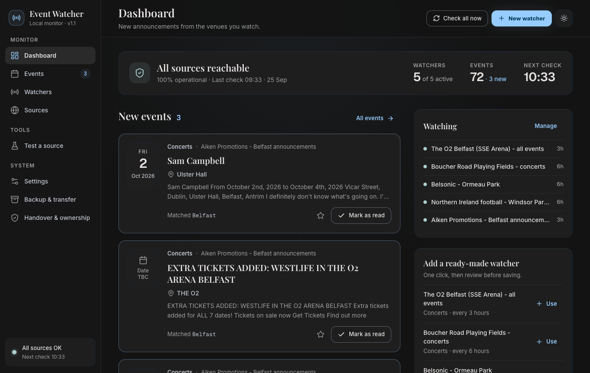
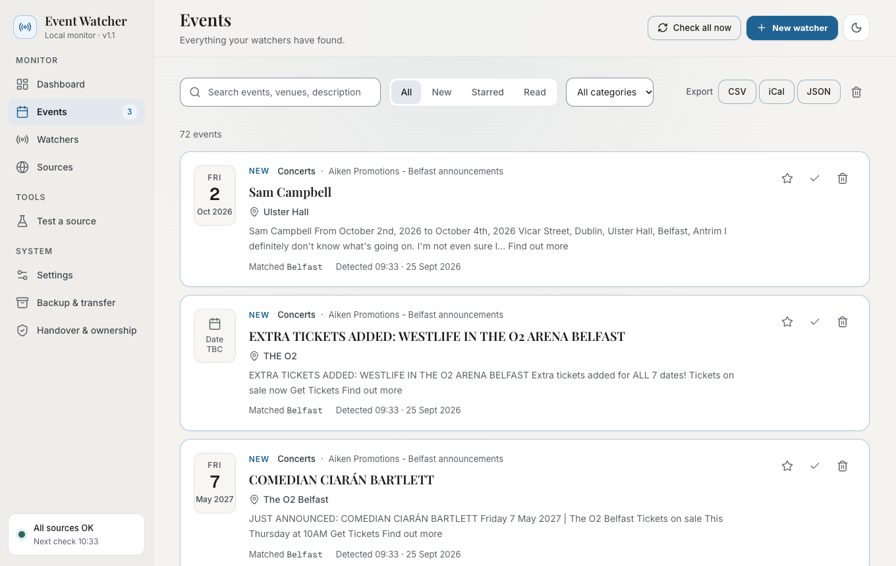
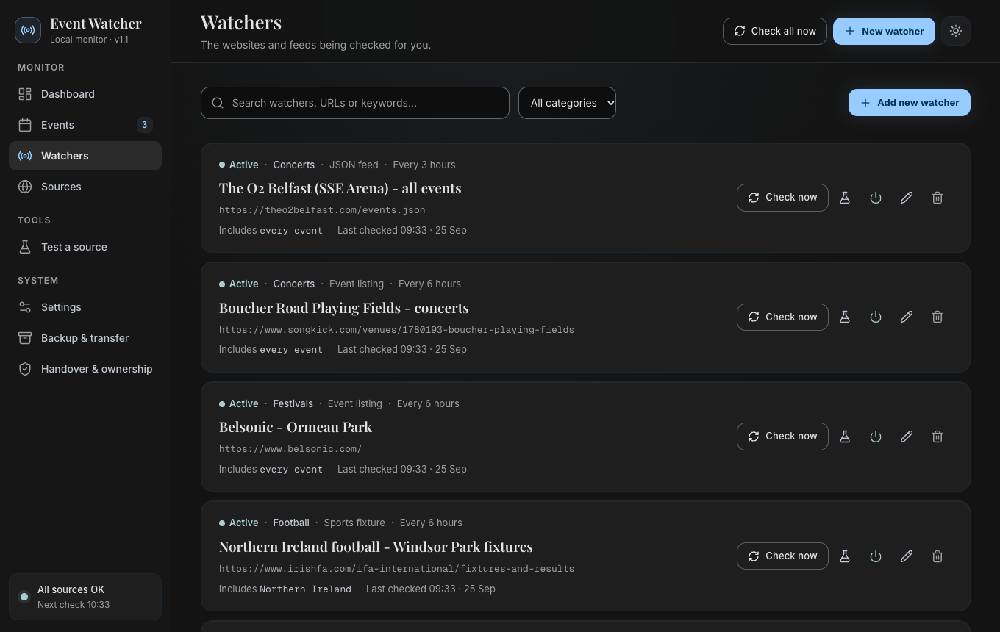

# Event Watcher

**Event Watcher tells you when a new event is announced at the Belfast venues you care about**: concerts at The O2 (formerly the SSE Arena), gigs at Boucher Road, Belsonic at Ormeau Park, Northern Ireland matches at Windsor Park, and any other venue you add.

It runs on your own computer, needs no account, password or subscription, and keeps working whether or not anyone else is around to look after it.



---

## Why this is yours: owned, controlled, understood

- **It belongs to whoever downloads it.** Event Watcher is open-source software under the [MIT licence](LICENSE). Once you download a copy, you may use it, change it, copy it to other computers or give it to someone else, forever. Nobody can switch it off or take it back.
- **No accounts.** There is no sign-up, login, email address, password, API key or subscription anywhere. There is nothing to store in 1Password because there is nothing to lose access to.
- **Nothing in the cloud.** The app and all its data live on your computer. It does not need this GitHub page, the original developer or any online service to keep running.
- **Nothing hidden.** No tracking or analytics. The only websites it contacts are the public venue pages listed in your watchers, the same pages you could open in a browser.
- **You can check everything.** The full source code is in this repository, and the app's **Handover & ownership** screen shows a 12-point independence checklist.

---

## How it finds events

A **watcher** is one website Event Watcher keeps an eye on, such as The O2's events page. The app ships with five watchers set up for Belfast, and you can add more.

1. **It visits the page.** Every few hours (you choose how often), the app opens the venue's public web page or feed, much as your browser does.
2. **It reads the list of events.** It picks out each event's name, date, venue and link. It only reads text; nothing from the website ever runs on your computer.
3. **It applies your words (optional).** You can give a watcher words to look for, such as *Belfast*, and words to ignore, such as *tribute*. With no words, every event from that source counts.
4. **It remembers what it has already seen.** The first check of a new watcher just records what is already listed. Events that have already happened are ignored, and a change such as "Sold Out" is not treated as a new event.
5. **It notifies you.** When something genuinely new appears, you get a normal desktop notification, even if the Event Watcher window is closed. For example: *"New event found — Westlife, The O2 Belfast"*.

If a website stops working or changes its layout so nothing can be read, the **Sources** screen shows it. After 3 failed checks in a row you get one *"a source needs attention"* notification. Nothing fails silently.

### What it watches out of the box

| Watcher | Where the information comes from |
|---|---|
| The O2 Belfast (formerly SSE Arena), every event | The venue's own public events list |
| Boucher Road Playing Fields, concerts | Songkick's public venue page (Boucher Road has no website of its own) |
| Belsonic at Ormeau Park | The festival's own website |
| Northern Ireland football (Windsor Park) | The Irish FA fixtures page |
| Aiken Promotions, Belfast announcements | The promoter's "just announced" page, filtered to Belfast |

One-click extras on the dashboard: Waterfront Hall, Ulster Hall and Visit Belfast.

---

## Getting started

1. **Download** the app from this repository's **Releases** page (right-hand side on GitHub):
   - Mac: `EventWatcher-mac.zip`. Unzip it to get **EventWatcher.app**, and move it to *Applications*.
   - Windows: **EventWatcher.exe**.
2. **Open it.**
   - **Mac, first time only:** right-click the app → **Open** → **Open**. macOS asks because the app is not registered with a paid Apple developer account. That is deliberate, so no one's account is involved.
   - **Windows, first time only:** if a blue *"Windows protected your PC"* box appears, click **More info → Run anyway**.
3. **Your browser opens the app** at `http://localhost:3847`. That page is Event Watcher. It is only reachable from your computer, not the internet or your network.
4. **Allow notifications** when your computer asks. Then go to **Settings → Send test notification** to check that they work.
5. **Optional:** in Settings, tick **Start Event Watcher when I log in**, so it always runs in the background.

You can close the browser tab at any time; checking and notifications carry on. Double-click the app again to reopen the page. To stop it completely, use **Settings → Stop Event Watcher**.

---

## Everyday use



| Screen | What you do there |
|---|---|
| **Dashboard** | See new announcements, mark them as read, star the important ones. |
| **Events** | Everything found so far. Search and filter, or export to **iCal** (Apple, Google or Outlook Calendar), **CSV** (Excel) or JSON. |
| **Watchers** | Add, edit, pause or delete what is watched, and change the words and how often each is checked. |
| **Sources** | Check whether every website is working, and how fast it responds. |
| **Test a source** | Try any website before adding it, to see what Event Watcher would find. Nothing is saved. |
| **Settings** | Notifications, sound, start at login, check frequency and the activity log. |
| **Backup & transfer** | Download a full backup, restore one, and set up automatic backups. |
| **Handover & ownership** | Where your data is, and the independence checklist. |

**Adding a venue:** open **Watchers → Add new watcher**, paste the venue's "What's on" address, press **Test source now** to confirm events are found, and save. Light and dark mode are switched with the ☀/☾ button.



---

## Keeping your data safe

- **Everything is in one folder on your computer:**
  - Mac: `~/Library/Application Support/EventWatcher`
  - Windows: `%APPDATA%\EventWatcher`

  **Backup & transfer → Open data folder** takes you there.
- **Automatic daily backups.** One full backup a day is saved in that folder, and the last 14 are kept. You can also have each backup copied to a folder the business controls, such as a USB drive or a company OneDrive or Dropbox folder, so a broken or lost computer never means lost data. If that folder cannot be reached, you get a notification.
- **Moving to a new computer:** on the old one, click **Download full backup**. On the new one, open Event Watcher and use **Import backup**. The data you replace is kept as a safety copy.
- The backup is a normal ZIP containing a standard SQLite database and readable JSON files, so your data can be opened by other tools too.

---

## Good to know

- **The computer must be on** for checks to happen. If it was off, missed checks run a few seconds after the app starts again. An office computer that stays on, with "start at login" ticked, works best.
- **Websites change.** If a venue redesigns its site, Event Watcher tells you (see above). Update or replace that watcher's address.
- **Boucher Road:** Belfast City Council has approved ending concerts there after 2027. That watcher can be removed then.
- The app is intentionally not code-signed (signing needs a paid Apple or Microsoft developer account), which is why the first launch asks for confirmation.

---

## For technical people

- [HANDOVER.md](HANDOVER.md): ownership checklist, what to keep and where, and how to move the app between people.
- [BUILD.md](BUILD.md): run from source (Python 3.9+, no extra packages), run the self-tests, change the interface and build the Mac and Windows apps. New releases are built automatically by GitHub Actions when a version tag is pushed.

```text
python_backend/   The app itself: local web server, checks, notifications, backups (Python standard library only)
web/              The interface: React source in web/src, ready-built files in web/dist
docs/             Screenshots used on this page
```

Security in brief: the app listens only on `127.0.0.1` (this computer) and refuses requests from other websites. It only fetches public internet addresses, never local-network ones, with size and time limits. Page content is treated as plain text.
